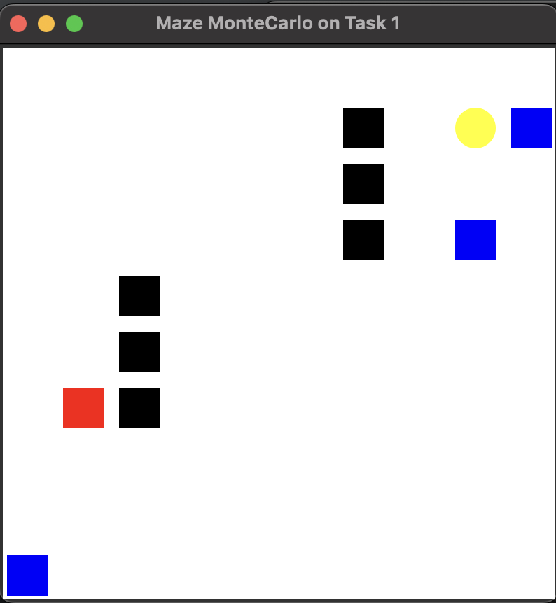
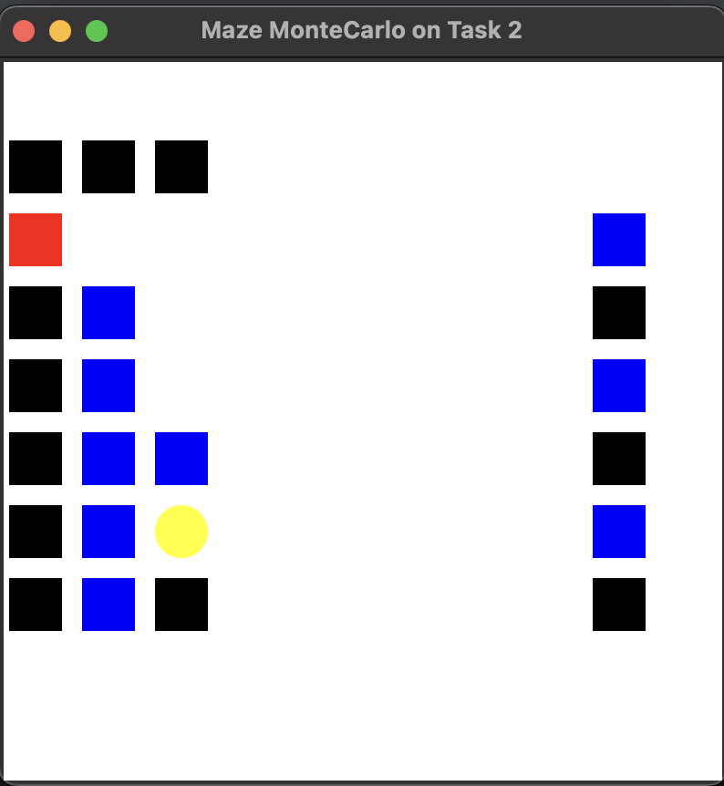
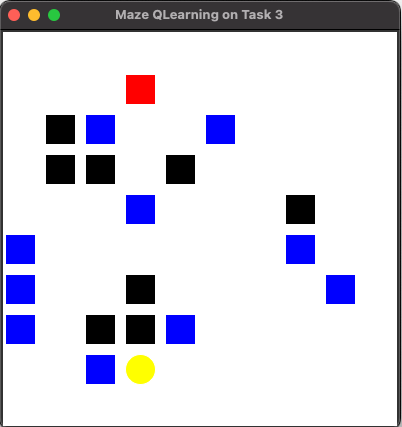

# Assignment: Maze World

## Domain Description - GridWorld

The domain consists of a 10x10 grid of cells. The agent being controlled is represented as a red square. The goal is a yellow oval and you receive a reward of 1 for reaching it, this ends and resets the episode.
Blue squares are **pits** which yield a penalty of -10 and end the episode. 
Black squares are **walls** which cannot be passed through. If the agent tries to walk into a wall they will remain in their current position and receive a penalty of -.3. Apart from these, the agent will receive a -0.1 for reaching any other cell in the grid since the objective is to move to the goal state as quickly as possible.
There are **three tasks** defined in `run_main.py` which can be commented out to try each. They include a combination of pillars, rooms, pits and obstacles. The aim is to learn a policy that maximizes expected reward and reaches the goal as quickly as possible. You can set the taskNum variable for each task to change which one is beined learned.

  

### First Demo Experiment 

Each combination of RL Algorithm and environment parameters constitutes an experiment that we will run for a number episodes, restarting the environment again each episode but keeping the value function learned so far. You can add a new entry for each experiment in the experiments list and then they will all plot side-by-side at the end.

## Assignment Tasks

This assignment will have a written component and a programming component.
Clone the mazeworld environment locally and run the code looking at the implementation of the sample algorithm. For each of the following four algorithms you will implement them using the corresponding skeleton code, and provide a brief report on the algorithm definition and implementation considerations. 

### Implement Four Core TD Methods

For each of the four algorithms there will be (**8%**) grading component for correct implementation. There are multiple ways to do this, but the approach should be runnable, and not be unnecessarily inefficient or difficult to follow.

**Code: (10% each)**

1. SARSA - Implement SARSA (`RL_brainsample_sarsa.py`) correctly
2. QLearning - Implement QLearning (`RL_brainsample_qlearning.py`) correctly
3. Expected SARSA - Implement Expected SARSA (`RL_brainsample_expsarsa.py`) correctly
4. Double QLearning - Implement Double QLearning (`RL_brainsample_doubqlearning.py`) correctly

**Report:**

- **Algorithm (5% each):** Definition of algorithm mathematically, design of code additions, discussion of implementation issues and choices.
- **Results Analysis (20% total):** Analysis of results of all the algorithms in terms of performance time, quality, etc. You can start with the plots we have provided, but you can add other analysis. You should look at quality as well as computation time for the training stage and the testing stage.